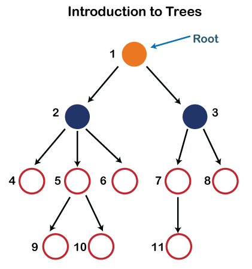
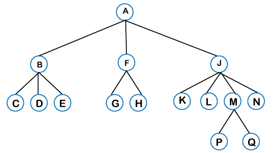
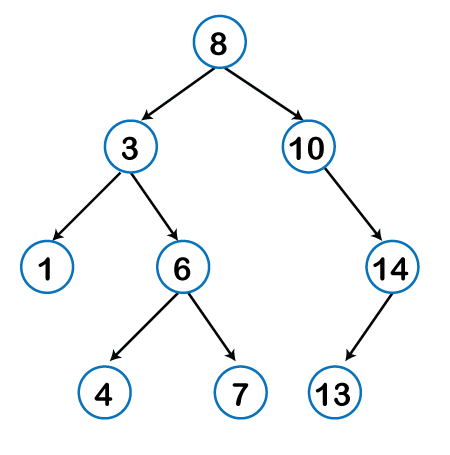

# Tree Data Structure

We read the linear data structures like an array, linked list, stack and queue in which all the elements are arranged in a sequential manner. The different data structures are used for different kinds of data.
A tree is also one of the data structures that represent hierarchical data. Suppose we want to show the employees and their positions in the hierarchical form then it can be represented as shown below:

##### Some key points of the Tree data structure.
* A tree data structure is defined as a collection of objects or entities known as nodes that are linked together to represent or simulate hierarchy.
* A tree data structure is a non-linear data structure because it does not store in a sequential manner. It is a hierarchical structure as elements in a Tree are arranged in multiple levels.
* In the Tree data structure, the topmost node is known as a root node. Each node contains some data, and data can be of any type. In the above tree structure, the node contains the name of the employee, so the type of data would be a string.
* Each node contains some data and the link or reference of other nodes that can be called children.

Consider the tree structure, which is shown below:



## Some basic terms used in Tree data structure.

* **Root**: The root node is the topmost node in the tree hierarchy. In other words, the root node is the one that doesn't have any parent. In the above structure, node numbered 1 is the root node of the tree. If a node is directly linked to some other node, it would be called a parent-child relationship.
* **Child node**: If the node is a descendant of any node, then the node is known as a child node.
* **Parent**: If the node contains any sub-node, then that node is said to be the parent of that sub-node.
* **Sibling**: The nodes that have the same parent are known as siblings.
* **Leaf Node**: The node of the tree, which doesn't have any child node, is called a leaf node. A leaf node is the bottom-most node of the tree. There can be any number of leaf nodes present in a general tree. Leaf nodes can also be called external nodes.
* **Internal nodes**: A node has at least one child node known as an internal
* **Ancestor node**: An ancestor of a node is any predecessor node on a path from the root to that node. The root node doesn't have any ancestors. In the tree shown in the above image, nodes 1, 2, and 5 are the ancestors of node 10.
* **Descendant**: The immediate successor of the given node is known as a descendant of a node. In the above figure, 10 is the descendant of node 5.

---

## Implementation of Tree

In programming, the structure of a node can be defined as:
```c
struct node  
{  
  int data;  
struct node *left;  
struct node *right;   
      } 
```
---

## Types of Tree data structure
Following are the types of a tree data structure :

* **General tree**: The general tree is one of the types of tree data structure. In the general tree, a node can have either 0 or maximum n number of nodes. There is no restriction imposed on the degree of the node (the number of nodes that a node can contain). The topmost node in a general tree is known as a root node. The children of the parent node are known as subtrees.



There can be n number of subtrees in a general tree. In the general tree, the subtrees are unordered as the nodes in the subtree cannot be ordered.
Every non-empty tree has a downward edge, and these edges are connected to the nodes known as child nodes. The root node is labeled with level 0. The nodes that have the same parent are known as siblings.

* **Binary tree**: Here, binary name itself suggests two numbers, i.e., 0 and 1. In a binary tree, each node in a tree can have utmost two child nodes. Here, utmost means whether the node has 0 nodes, 1 node or 2 nodes.



* **Binary Search tree**: Binary search tree is a non-linear data structure in which one node is connected to n number of nodes. It is a node-based data structure. A node can be represented in a binary search tree with three fields, i.e., data part, left-child, and right-child. A node can be connected to the utmost two child nodes in a binary search tree, so the node contains two pointers (left child and right child pointer).
Every node in the left subtree must contain a value less than the value of the root node, and the value of each node in the right subtree must be bigger than the value of the root node.

* **AVL tree**: It is one of the types of the binary tree, or we can say that it is a variant of the binary search tree. AVL tree satisfies the property of the binary tree as well as of the binary search tree. It is a self-balancing binary search tree that was invented by Adelson Velsky Lindas. Here, self-balancing means that balancing the heights of left subtree and right subtree. This balancing is measured in terms of the _balancing factor_.
We can consider a tree as an AVL tree if the tree obeys the binary search tree as well as a balancing factor. The balancing factor can be defined as the difference between the height of the left subtree and the height of the right subtree. The balancing factor's value must be either 0, -1, or 1; therefore, each node in the AVL tree should have the value of the balancing factor either as 0, -1, or 1.

* **Red-Black Tree**
The red-Black tree is the binary search tree. The prerequisite of the Red-Black tree is that we should know about the binary search tree. In a binary search tree, the value of the left-subtree should be less than the value of that node, and the value of the right-subtree should be greater than the value of that node. As we know that the time complexity of binary search in the average case is log2n, the best case is O(1), and the worst case is O(n).
When any operation is performed on the tree, we want our tree to be balanced so that all the operations like searching, insertion, deletion, etc., take less time, and all these operations will have the time complexity of log2n.
The red-black tree is a self-balancing binary search tree. AVL tree is also a height balancing binary search tree then why do we require a Red-Black tree. In the AVL tree, we do not know how many rotations would be required to balance the tree, but in the Red-black tree, a maximum of 2 rotations are required to balance the tree. It contains one extra bit that represents either the red or black color of a node to ensure the balancing of the tree.

---

> Practice questions [here](https://www.geeksforgeeks.org/binary-tree-data-structure/).
