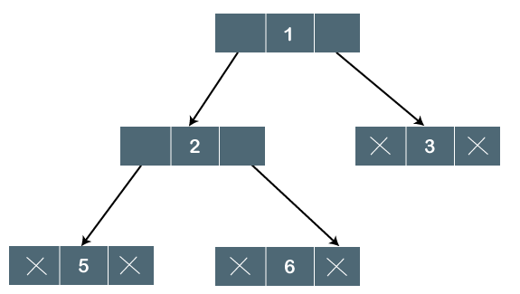
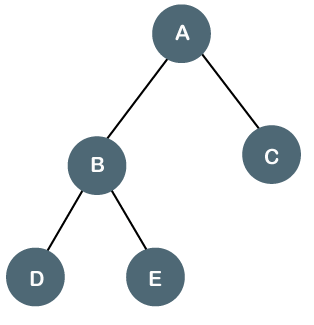
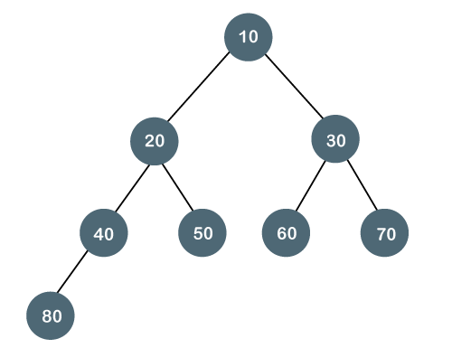
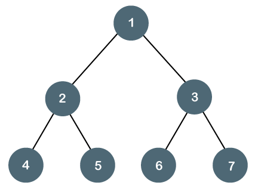
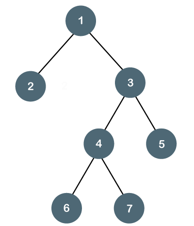
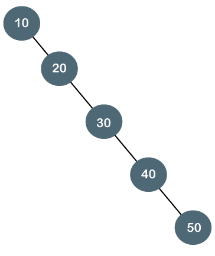
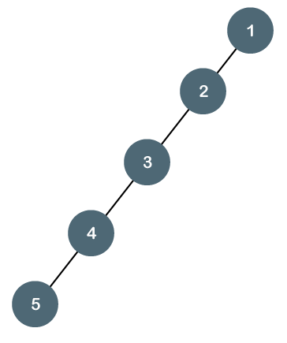
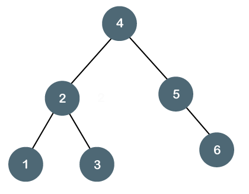
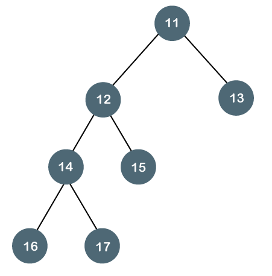

# Binary Tree
The Binary tree means that the node can have maximum two children. Here, binary name itself suggests that 'two'; therefore, each node can have either 0, 1 or 2 children.

Example:

 

 The above tree is a binary tree because each node contains the utmost two children. The logical representation of the above tree is given below:

 

 In the above tree, node 1 contains two pointers, i.e., left and a right pointer pointing to the left and right node respectively. The node 2 contains both the nodes (left and right node); therefore, it has two pointers (left and right). The nodes 3, 5 and 6 are the leaf nodes, so all these nodes contain **NULL** pointer on both left and right parts.

---

## Properties of Binary Tree

* At each level of i, the maximum number of nodes is 2i.
* The height of the tree is defined as the longest path from the root node to the leaf node. The tree which is shown above has a height equal to 3. Therefore, the maximum number of nodes at height 3 is equal to (1+2+4+8) = 15. In general, the maximum number of nodes possible at height h is (20 + 21 + 22+….2h) = 2h+1 -1.
* The minimum number of nodes possible at height h is equal to h+1.
* If the number of nodes is minimum, then the height of the tree would be maximum. Conversely, if the number of nodes is maximum, then the height of the tree would be minimum.

If there are 'n' number of nodes in the binary tree.

###### The minimum height can be computed as:  
As we know that,
n = 2<sup>h+1</sup>-1  
n+1 = 2<sup>h+1</sup>

Taking log on both the sides,  
log<sub>2</sub>(n+1) = log<sub>2</sub>(2<sup>h+1</sup>)  

log<sub>2</sub>(n+1) = h+1  
h = log<sub>2</sub>(n+1) - 1  
###### The maximum height can be computed as:
As we know that,  
n = h+1  
h = n-1

---

## Types of Binary Tree
There are four types of Binary tree:
* Full/ proper/ strict Binary tree
* Complete Binary tree
* Perfect Binary tree
* Degenerate Binary tree
* Balanced Binary tree

### 1. Full/ proper/ strict Binary tree
The full binary tree is also known as a strict binary tree. The tree can only be considered as the full binary tree if each node must contain either 0 or 2 children. The full binary tree can also be defined as the tree in which each node must contain 2 children except the leaf nodes.
Let's look at the simple example of the Full Binary tree.

 

 In the above tree, we can observe that each node is either containing zero or two children; therefore, it is a Full Binary tree.

##### Properties of Full Binary Tree
* The number of leaf nodes is equal to the number of internal nodes plus 1. In the above example, the number of internal nodes is 5; therefore, the number of leaf nodes is equal to 6.
* The maximum number of nodes is the same as the number of nodes in the binary tree, i.e., 2h+1 -1.
* The minimum number of nodes in the full binary tree is 2*h-1.
* The minimum height of the full binary tree is log<sub>2</sub>(n+1) - 1.
* The maximum height of the full binary tree can be computed as:  
n = 2\*h - 1  
n+1 = 2*h  
h = n+1/2


### 2. Complete Binary Tree
The complete binary tree is a tree in which all the nodes are completely filled except the last level. In the last level, all the nodes must be as left as possible. In a complete binary tree, the nodes should be added from the left.
Let's create a complete binary tree.



The above tree is a complete binary tree because all the nodes are completely filled, and all the nodes in the last level are added at the left first.

##### Properties of Complete Binary Tree
* The maximum number of nodes in complete binary tree is 2h+1 - 1.
* The minimum number of nodes in complete binary tree is 2h.
* The minimum height of a complete binary tree is log<sub>2</sub>(n+1) - 1.
* The maximum height of a complete binary tree with minimum “n” nodes is h = log(n).


### 3. Perfect Binary Tree
A tree is a perfect binary tree if all the internal nodes have 2 children, and all the leaf nodes are at the same level.
Let's look at a simple example of a perfect binary tree.



The below tree is not a perfect binary tree because all the leaf nodes are not at the same level.



**Note:** All the perfect binary trees are the complete binary trees as well as the full binary tree, but vice versa is not true, i.e., all complete binary trees and full binary trees are the perfect binary trees.

### 4. Degenerate Binary Tree
The degenerate binary tree is a tree in which all the internal nodes have only one children.
Let's understand the Degenerate binary tree through examples.



The above tree is a degenerate binary tree because all the nodes have only one child. It is also known as a right-skewed tree as all the nodes have a right child only.



The above tree is also a degenerate binary tree because all the nodes have only one child. It is also known as a left-skewed tree as all the nodes have a left child only.

### 5. Balanced Binary Tree
The balanced binary tree is a tree in which both the left and right trees differ by at most 1. For example, AVL and Red-Black trees are balanced binary tree.
Let's understand the balanced binary tree through examples.



The above tree is a balanced binary tree because the difference between the left subtree and right subtree is zero.



The above tree is not a balanced binary tree because the difference between the left subtree and the right subtree is greater than 1.

---

## Binary Tree Implementation
A Binary tree is implemented with the help of pointers. The first node in the tree is represented by the root pointer. Each node in the tree consists of three parts, i.e., data, left pointer and right pointer. To create a binary tree, we first need to create the node. We will create the node of user-defined as shown below:

```cpp
struct node  
{  
   int data,  
   struct node *left, *right;  
}
```

In the above structure, data is the value, left pointer contains the address of the left node, and right pointer contains the address of the right node.

##### Binary Tree program in C
```c
#include<stdio.h>   
            struct node   
          {   
                    int data;   
                    struct node *left, *right;   
            }
            void main()   
        {   
              struct node *root;   
              root = create();   
        }   
struct node *create()   
{   
      struct node *temp;   
      int data;   
      temp = (struct node *)malloc(sizeof(struct node));   
      printf("Press 0 to exit");   
      printf("\nPress 1 for new node");   
      printf("Enter your choice : ");   
      scanf("%d", &choice);     
      if(choice==0)   
{   
return 0;   
}   
else   
{   
      printf("Enter the data:");   
      scanf("%d", &data);   
      temp->data = data;   
      printf("Enter the left child of %d", data);   
      temp->left = create();   
printf("Enter the right child of %d", data);   
temp->right = create();  
return temp;     
}   
}   
```

The above code is calling the create() function recursively and creating new node on each recursive call. When all the nodes are created, then it forms a binary tree structure. The process of visiting the nodes is known as tree traversal. There are three types traversals used to visit a node:

* Inorder traversal
* Preorder traversal
* Postorder traversal


---

> Learn more about binary trees [here](https://dzone.com/articles/binary-trees-part-1).
